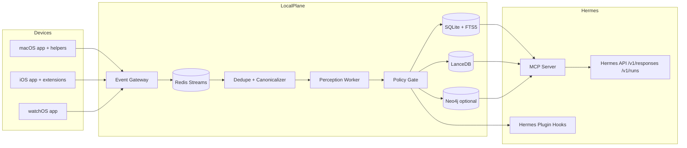
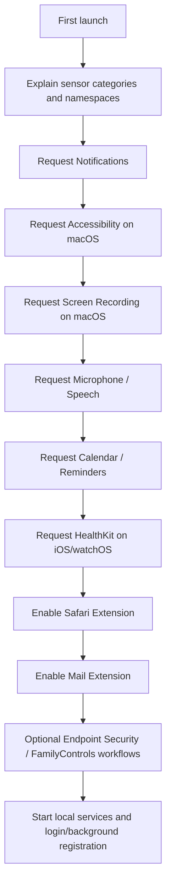
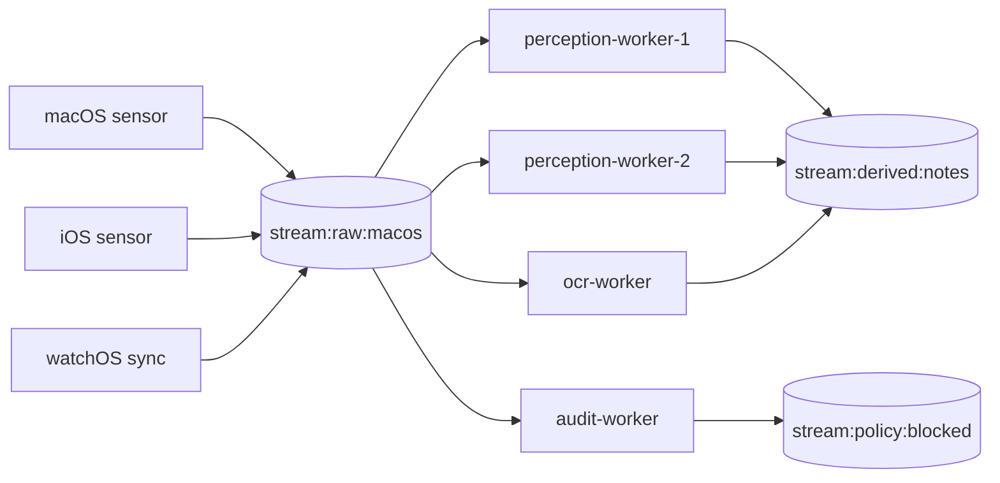
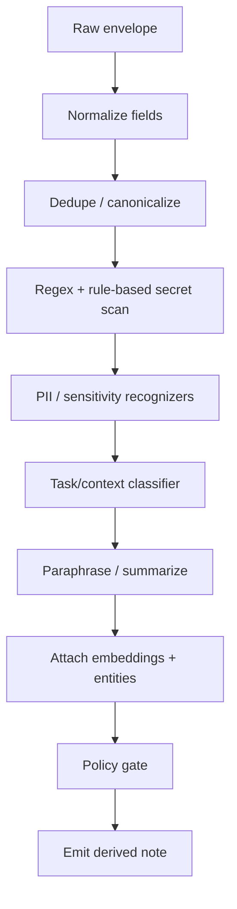
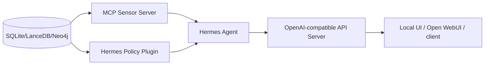
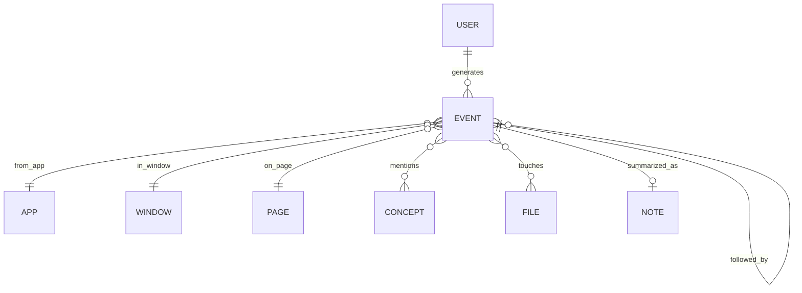

# Hermes Sensor System Specification

## Executive Summary

The best architecture for this project in May 2026 is **local-first, consent-first, and layered**: native sensors on each Apple platform, a **short-lived local event buffer** for raw observations, a **local AI perception worker** that redacts and paraphrases before Hermes sees anything, and a **retrieval-oriented integration** with Hermes rather than shoveling every raw event directly into prompt context. On macOS, Apple’s public APIs are rich enough to build a strong ambient sensor using ScreenCaptureKit, Accessibility, NSWorkspace, Vision, Speech, EventKit, MailKit, Safari Web Extensions, File Provider, Core Audio, FSEvents, Keychain, and—if you have the entitlement—Endpoint Security. On iOS and watchOS, the public APIs are intentionally more constrained, so the design must center on Share Extensions, Safari Web Extensions, App Intents, BackgroundTasks, DeviceActivity, HealthKit, and WatchConnectivity instead of trying to “see everything.” citeturn22search13turn22search1turn20search0turn21search1turn6search2turn7search2turn18search10turn17search0turn8search1turn9search0turn9search1turn8search2turn8search3

I am **not** providing a design for keylogging, covert interception, or bypassing Apple permission prompts. Apple’s privacy and extension models are built around user approval, separate extension processes, and explicit authorization flows; legitimate apps on Apple platforms do not get a public API for hidden global keystroke capture or silent access to other apps’ private content on iPhone or Apple Watch. The specification below is therefore an **always-on, user-approved ambient sensor**: once permission is granted, it can run persistently where the platform allows, but it remains visible, pausable, and auditable. citeturn8search12turn12search24turn7search15turn18search1turn9search21

For storage, the strongest default is **Redis Streams as an ephemeral bus**, **SQLite + FTS5 as the durable event/timeline store**, **LanceDB as the local embedding store**, and **Neo4j as an optional graph layer** when you truly need graph-native path queries and pattern mining. For local workloads, this is materially simpler and safer than deploying Milvus or PostgreSQL on day one. I do **not** recommend RedisGraph for a new build here; the current Redis documentation we reviewed is centered on Streams and other core data types, and current official Redis materials do not present RedisGraph as a first-line option for new local application design. citeturn35search0turn35search1turn35search2turn37search2turn32search2turn31search10turn31search0turn32search1turn31search7turn33search0

For Hermes integration, the current best practice is **two-layered**: expose the sensor system as a **local MCP server** so Hermes can discover sensor tools at startup, and optionally ship a **Hermes plugin** for pre-LLM context injection, policy hooks, and memory/provider adapters. Hermes already supports both a built-in MCP client and a plugin system distributed through pip entry points, and its API server is OpenAI-compatible via `/v1/responses`, `/v1/chat/completions`, and the more streaming-friendly Runs API. citeturn38view5turn38view0turn38view1turn38view2turn38view3turn38view4

## Recommended Architecture

The most robust end-to-end design is a **three-ring architecture**: native sensors gather signals, a local policy-and-perception layer normalizes and redacts them, and Hermes consumes only **retrievable summaries plus gated raw fetches**. This avoids duplicate context, keeps raw data local, and aligns with Apple’s permission model and Hermes’s tool-centric architecture. citeturn22search13turn20search0turn38view5turn38view2



### Canonical design choices

The **macOS app** should be a native Swift AppKit/SwiftUI bundle with a login item or LaunchAgent for persistence, plus optional extension targets for MailKit, File Provider, and Safari Web Extension packaging. If you later add Endpoint Security, that piece should remain modular because entitlement handling, distribution, and review are materially different from a normal desktop app. citeturn17search0turn19search2turn8search1turn5search21turn13search8turn20search23

The **iOS app** should be an application plus extension suite: Share Extension, Safari Web Extension, App Intents/Shortcuts surface, optional DeviceActivity/FamilyControls extension, and BackgroundTasks handlers. The **watchOS app** should be a thin companion optimized for HealthKit ingestion, user controls, and WatchConnectivity transfers back to the phone. Apple’s docs make clear that extensions are separate processes and that background execution must use the approved framework-specific strategies rather than a desktop-style perpetual daemon. citeturn8search12turn8search1turn15search4turn9search0turn9search4turn8search3turn8search2

The **event gateway** should be local-only and append normalized envelopes into Redis Streams. Each event gets a stable `event_id`, `source_device_id`, `sensor_id`, `observed_at`, `semantic_scope`, and a `dedupe_key`. The canonicalizer then resolves overlap using explicit precedence rules: **browser extension beats OCR**, **AX focused-field beats OCR for text fields**, **MailKit beats screen-derived email guesses**, **EventKit beats OCR of calendar UI**, and **HealthKit aggregate beats watch UI text**. This is the main defense against “duplicate info randomly.” citeturn16search0turn6search2turn20search1turn17search1turn18search10turn8search2turn35search0

The **perception worker** should never be optional in production. It does four things before Hermes ever sees an event: normalization, secret/PII detection, sensitivity scoring, and paraphrase generation. Hermes should retrieve a short note like “User was comparing two vendor pricing pages in Safari and copied a shipping quote into their CRM tab” instead of raw screen text by default. Raw material stays locally addressable through explicit tool calls and policies. citeturn29search0turn29search3turn38view2turn38view5

### Recommended persistence model

Use **Redis Streams** only as the short-term, decoupling layer. Redis Streams are built as append-only logs with complex consumption strategies such as consumer groups, which is exactly what you want between sensors and workers. They are not your long-term truth store. citeturn35search0turn35search1

Use **SQLite + FTS5** as the local source of truth for timeline events and text search. SQLite is embedded, low-friction, easy to back up, and FTS5 is mature and built in. For a single-user desktop system, that matters more than distributed database features. Add **LanceDB** alongside it for embedding search and multimodal retrieval, because LanceDB is explicitly designed to keep metadata and embeddings together and works happily against a local path. Add **Neo4j** only if you truly need graph-native traversals, workflow mining, and “what usually follows what” queries beyond what a relational/sequence design can deliver efficiently. citeturn32search2turn31search10turn37search2turn31search0turn32search0turn32search1

### Recommended graph/data split

Use this split from the start:

| Layer | Purpose | Recommended tech |
|---|---|---|
| Ephemeral bus | raw fan-in, backpressure, retries | Redis Streams |
| Durable timeline | exact event history, text search, audit | SQLite + FTS5 |
| Semantic retrieval | embeddings, nearest-neighbor notes/chunks | LanceDB |
| Relationship mining | cross-event graph patterns | Neo4j optional |

This split is grounded in the official capabilities of Redis Streams, SQLite FTS5, LanceDB, and Neo4j vector/graph features. PostgreSQL + pgvector is a strong alternative if you already operate Postgres; Milvus is best reserved for higher-scale vector-heavy deployments rather than a personal local stack. citeturn35search0turn32search2turn31search10turn32search1turn33search0turn31search7

## Official Platform Capabilities and Limits

### macOS sensor surface

macOS is the only Apple platform in this set where you can build a genuinely rich ambient sensor with public APIs. The recommended sensor stack is below. citeturn22search13turn20search0turn21search1

| API | What to use it for | Permission / entitlement notes |
|---|---|---|
| ScreenCaptureKit | window- or display-level frame capture; optional window audio | Screen Recording approval required; Apple notes you need permission before capture and that shareable windows/displays are the capture units. citeturn22search13turn22search1 |
| Accessibility / AXUIElement | frontmost app, focused window, focused field text, control labels, clicks | Accessibility trust required via trusted client flow. citeturn20search0turn20search1turn20search20 |
| NSWorkspace | app launches, frontmost-app changes, running apps | No special entitlement for basic notifications. citeturn21search1turn21search6turn21search16 |
| Vision | OCR and document understanding on captured frames or files | No special user prompt for local OCR itself; input source permissions still apply. citeturn6search2turn6search10 |
| Speech + AVFoundation | microphone transcription, short voice notes, live speech | Microphone + Speech Recognition authorization. citeturn7search2turn6search21turn6search1 |
| NaturalLanguage | tokenization, entity extraction, language/sentiment pre-pass | No additional permission. citeturn6search3 |
| MailKit | Apple Mail metadata/actions/compose hooks | Apple Mail only; extension target required. citeturn17search0turn17search1turn17search2 |
| EventKit | calendars and reminders | explicit read/write/full-access flows. citeturn18search10turn18search1turn18search21 |
| Keychain Services | secrets for local APIs, OAuth tokens, encryption keys | use Keychain access groups only when needed. citeturn13search0turn13search3turn13search16 |
| Core Audio | system-audio taps, device events, loopback-style capture | app-level capture still subject to user/system controls. citeturn14search24turn14search1 |
| UserNotifications | local actionable alerts, pause/approve/forget controls | notification permission required. citeturn12search0turn12search24 |
| File Provider | synced “Hermes Memory” drive and working set | extension target and domain model. citeturn19search2turn19search5 |
| FSEvents | file-change notifications for watched trees | best for workspace folders and user-authorized directories. citeturn23search1turn23search2turn23search19 |
| Endpoint Security | process/file execution metadata for security-style telemetry | special entitlement required; keep optional. citeturn5search21 |

The practical macOS rule is simple: **capture structure first, pixels second**. If AX or a browser extension can tell you what the user is doing, do that. Only fall back to OCR/screen analysis when the higher-level signal is unavailable. This lowers compute, improves dedupe, and reduces accidental capture of sensitive pixels. citeturn20search1turn16search0turn6search2

### iOS sensor surface

iOS is intentionally much more restrictive. The public architecture that works well is **user-shared context + privacy-preserving activity summaries + app-owned activity surfaces**. A background universal observer for other apps does not exist in the public SDK. citeturn8search12turn9search4turn9search1

| API | What to use it for | Important limit |
|---|---|---|
| Share Extension | user sends page/text/image/document to Hermes sensor | user-invoked only; extension runs separately. citeturn8search0turn8search12 |
| Safari Web Extension | capture page URL/title/selection/DOM facts inside Safari | limited to Safari; permissioned browser model. citeturn8search1turn16search0turn16search2 |
| App Intents / Shortcuts | “Remember this”, “Summarize current work”, “Log this task” | user-invoked system surface. citeturn15search4turn15search0turn15search36 |
| BackgroundTasks | deferred sync and local processing | system-scheduled, not continuous daemon mode. citeturn9search0turn9search26 |
| DeviceActivity + FamilyControls | privacy-preserving app/website activity summaries | uses opaque tokens, entitlement and guardian/device-owner approval flow. citeturn9search1turn9search2turn9search21 |
| Speech + AVFoundation | microphone notes and in-app audio capture | no third-party app audio snooping. citeturn7search2turn6search1 |
| HealthKit | personal health and fitness data with permission | user-specific health authorization required. citeturn8search2turn8search10 |
| WatchConnectivity | receive watch summaries/files/events | paired-device transfer only. citeturn8search3turn8search7 |

The correct iOS strategy is therefore: **make it frictionless to share context into Hermes**, then supplement with DeviceActivity aggregates and HealthKit/background sync. Do not try to emulate macOS-style universal sensing on iPhone using undocumented or stealthy approaches. citeturn8search0turn9search1turn8search2turn8search12

### watchOS sensor surface

watchOS is best treated as a **high-signal, low-bandwidth personal telemetry node**: health samples, workouts, heart rate, motion, and fast user controls. Use it for “what was happening physically or habitually,” not for browser/chat/email collection. citeturn8search2turn8search18turn15search31

The best watch roles are: HealthKit aggregation, voice note trigger, one-tap pause/resume of sensing, workout-aware context, and low-friction user annotations that sync back over WatchConnectivity. Background work must stay within the platform’s background task and workout/health delivery constraints. citeturn8search3turn9search32turn8search18

### Permission and entitlement flow

The startup flow should be explicit and staged:



Do not ask for everything at boot if the user has not enabled the corresponding sensor modules. Gate permission prompts by feature toggles. This reduces drop-off, avoids unnecessary TCC surface area, and keeps the sensor suite explainable. The APIs above explicitly require user authorization or entitlement setup for the sensitive surfaces. citeturn20search0turn22search1turn7search15turn18search1turn8search10turn9search21turn5search21

## Event Model and Data Plane

### Base event envelope

Every sensor should emit the same base envelope, regardless of platform:

```json
{
  "event_id": "01JVVK4N7KC1J2W4TZGZ2QG1R5",
  "event_type": "activity.browser_page",
  "schema_version": "2026-05-11",
  "source_device_id": "macbook-pro-m4",
  "source_platform": "macos",
  "sensor_id": "safari_webext",
  "sensor_version": "0.1.0",
  "observed_at": "2026-05-11T16:41:23.184Z",
  "ingested_at": "2026-05-11T16:41:23.401Z",
  "session_id": "sess_8x4c",
  "dedupe_key": "sha256:...",
  "sensitivity": "medium",
  "raw_scope": "ephemeral",
  "payload": {},
  "redactions": [],
  "relationships": [],
  "tags": ["work", "browser", "pricing"]
}
```

Use **ULIDs** or sortable IDs so timeline ordering remains stable. `observed_at` is “when the source saw it.” `ingested_at` is “when the gateway persisted it.” `raw_scope` is one of `none`, `ephemeral`, or `durable-by-policy`. `sensitivity` is one of `low`, `medium`, `high`, or `blocked`. citeturn35search0turn38view2

### Supported event families

The system should support these first-class event types:

| Family | Event types |
|---|---|
| App/window activity | `activity.app_focus`, `activity.window_focus`, `activity.focused_field` |
| Browser | `activity.browser_page`, `activity.browser_selection`, `activity.browser_form_submit`, `activity.browser_download` |
| Screen/OCR | `activity.screen_frame_ocr`, `activity.ui_snapshot` |
| Speech/audio | `activity.voice_note`, `activity.speech_transcript`, `activity.system_audio_transcript` |
| Email | `activity.mail_metadata`, `activity.mail_compose`, `activity.mail_action` |
| Calendar/reminders | `activity.calendar_item`, `activity.reminder_item` |
| Files | `activity.file_change`, `activity.file_open`, `activity.file_provider_sync` |
| Health/device usage | `activity.health_summary`, `activity.device_activity_summary`, `activity.watch_annotation` |
| Derived/perception | `perception.note`, `perception.entity_link`, `perception.workflow_edge`, `perception.policy_block` |
| System | `system.permission_state`, `system.sensor_heartbeat`, `system.error`, `system.dead_letter` |

This split maps cleanly to the official platform capabilities listed above and gives you enough structure to avoid vague “blob events.” citeturn21search1turn16search0turn6search2turn17search0turn18search10turn23search1turn8search2turn9search1

### Payload schemas for the most important events

`activity.app_focus`

```json
{
  "app": {
    "bundle_id": "com.apple.Safari",
    "name": "Safari",
    "pid": 931
  },
  "window": {
    "title": "Vendor pricing – Safari",
    "ax_role": "AXWindow"
  },
  "reason": "frontmost_changed"
}
```

`activity.focused_field`

```json
{
  "app": { "bundle_id": "com.hubspot.HubSpot" },
  "field": {
    "role": "AXTextField",
    "label": "Deal amount",
    "placeholder": "$0.00"
  },
  "text": "$18,500",
  "text_mode": "raw_or_redacted",
  "selection": { "start": 0, "end": 7 }
}
```

`activity.browser_page`

```json
{
  "browser": "Safari",
  "tab_id": "safari:18:4",
  "url": "https://vendor.example.com/pricing",
  "domain": "vendor.example.com",
  "title": "Pricing and plans",
  "selection_text": null,
  "referrer_domain": "google.com"
}
```

`activity.screen_frame_ocr`

```json
{
  "capture_target": {
    "type": "window",
    "window_id": 48291,
    "bundle_id": "com.apple.Safari"
  },
  "ocr_blocks": [
    { "text": "Annual plan", "bbox": [0.11, 0.21, 0.24, 0.03], "confidence": 0.98 }
  ],
  "frame_hash": "sha256:..."
}
```

`perception.note`

```json
{
  "summary": "User compared annual vs monthly vendor pricing in Safari while editing a CRM deal amount field.",
  "evidence_event_ids": [
    "01JVVK4N7KC1J2W4TZGZ2QG1R5",
    "01JVVK4Q4E8AY6TQMYY7Q3VM3E",
    "01JVVK4VY1A25VQ5Z6T9QV9NHS"
  ],
  "entities": [
    { "type": "app", "value": "Safari" },
    { "type": "task", "value": "compare_pricing" }
  ],
  "confidence": 0.86
}
```

### Redis Streams keyspace and TTL design

Redis Streams should be the fast-changing staging layer. Recommended key pattern:

| Key | Purpose | Consumer group | Retention target |
|---|---|---|---|
| `stream:raw:macos` | normalized raw macOS events | `cg-perception` | 24h |
| `stream:raw:ios` | normalized raw iOS events | `cg-perception` | 24h |
| `stream:raw:watchos` | normalized raw watch data | `cg-perception` | 24h |
| `stream:derived:notes` | paraphrases and enrichment | `cg-storage`, `cg-hermes` | 30d |
| `stream:policy:blocked` | blocked/redacted outputs | `cg-audit` | 30d |
| `stream:system:metrics` | heartbeats and counters | `cg-monitoring` | 7d |
| `stream:dlq` | poison-pill or retried-out events | `cg-ops` | 30d |

Use `XADD` to append, `XGROUP CREATE` to initialize consumer groups, `XREADGROUP` for normal processing, `XAUTOCLAIM` to recover stale pending messages, `XPENDING`/`XINFO` for inspection, and `XTRIM` with approximate trimming for memory discipline. The current Redis docs also note newer trimming/reference options in Redis 8.2+, so pin your Redis version and test trimming behavior with consumer groups before production rollout. citeturn35search15turn35search11turn35search1turn35search3turn35search18turn35search2turn35search0

Recommended operational values:

| Policy | Value |
|---|---|
| Stream append | `XADD key MAXLEN ~ 100000 * ...` |
| Ack deadline | 60s for lightweight workers; 300s for OCR/LLM jobs |
| Reclaim threshold | 2× ack deadline |
| Max delivery attempts | 5 |
| DLQ routing | after attempt 5 or on policy parser failure |
| Dedupe key TTL | 10 minutes for activity-level events |
| Screen frame TTL | 2 hours max if raw pixels retained at all |
| Raw text TTL | 24 hours |
| Derived note TTL | 30 days default |
| User-forgotten scopes | immediate purge + tombstone index update |

### Consumer-group pattern

Use a **single-writer, many-consumer** pattern per stream family:



Do **not** create a separate stream per sensor unless volume forces you to. Start with coarse platform-level streams and a typed envelope. That keeps introspection manageable in Redis Insight and simplifies group recovery. citeturn35search14turn35search4

### Dead-letter handling and metrics

A dead-letter event should contain the original envelope, `failure_stage`, `attempt_count`, `first_seen_at`, `last_error`, and a boolean `safe_to_replay`. Poison-pill payloads that repeatedly crash a parser should be quarantined, not replayed automatically. Monitor: stream lag, pending count, reclaim count, p95 worker latency, blocked event rate, redaction hit rate, and bytes written per sensor. `redis_exporter` plus Prometheus and Grafana are sufficient for the first version. citeturn34search2turn34search10turn34search13

## Local AI Perception Worker

### Processing pipeline

The perception worker should implement the following strict order:



The design deliberately uses **rules first, model second**. Secret detection is one of the places where deterministic scanners beat small local LLMs reliably: API keys, bearer tokens, passwords, OAuth codes, SSNs, payment card formats, private key headers, cookie jars, and 2FA prompts should be caught by regex/recognizer layers before any generative step. Microsoft Presidio explicitly positions itself as a detection and anonymization toolkit for PII across text and images, and also explicitly warns that automated detection is incomplete, which is the right mental model here: combine it with additional controls. citeturn29search0turn29search3

### Redaction rules

Minimum rule packs:

| Class | Example detectors | Default action |
|---|---|---|
| Credentials | `AKIA…`, `ghp_`, `sk-…`, private key PEM headers, bearer tokens | block raw, emit note only |
| Auth flows | 2FA code prompts, OTP messages, password fields, login forms | block raw and screen crop |
| Financial | full card numbers, bank account patterns, tax IDs | redact digits except last 4 |
| Health | raw HRV, ECG, diagnosis text, medication lists | aggregate only unless user opted in |
| Personal identifiers | emails, phone numbers, addresses, SSNs | hash or replace with typed markers |
| Sensitive apps/pages | banking, password managers, identity providers, payroll | force note-only mode |

For browser and screen events, the policy gate should maintain a **denylist of domains/apps** and a **structured sensitivity escalation**. Example: if `bundle_id == com.1password.1password7` or the host matches a password manager / bank / MFA provider allowlist, suppress raw event propagation entirely and only emit a heartbeat like “sensitive surface active; capture paused for this scope.” This is also your strongest legal and trust-preserving move. citeturn38view2turn29search0

### Allowed and blocked outputs

**Allowed to Hermes by default**
- paraphrased task summaries
- app and window names
- sanitized domain names and page titles
- sanitized OCR snippets after secret stripping
- calendar/reminder semantics
- Apple Mail metadata summaries
- DeviceActivity aggregates
- HealthKit aggregates and trends
- embedding-backed semantic recall snippets

**Blocked by default**
- raw password text
- raw keystroke streams
- 2FA codes
- session cookies
- bearer/API tokens
- private keys
- sensitive-bank/payroll/password-manager screen crops
- exact health/medical free text unless explicitly enabled
- raw third-party message database scraping
- silent hidden capture modes or permission bypass

That last line is deliberate and non-negotiable for this design. It keeps the system usable on Apple platforms and prevents the perception layer from becoming a false justification for dangerous collection primitives. citeturn8search12turn12search24turn9search21

### Paraphrase templates

Use constrained templates rather than free-form LLM prose for the first year:

- `User worked in {app} on {task} involving {entity_set}.`
- `User compared {item_a} and {item_b} in {browser/app}.`
- `User created or edited {object_type} with due date {date}.`
- `User discussed {topic} in a voice note; action item likely {action}.`
- `User’s recent workflow pattern: {event_a} -> {event_b} -> {event_c}.`

These templates improve determinism, lower token cost, and reduce leakage risk.

### Recommended local models and runtimes

The best default model strategy is **Apple-native first on Apple hardware, open-weight fallback everywhere else**.

| Task | Recommended default | Size / context | Runtime | Notes |
|---|---|---|---|---|
| Short summaries, rewrite, classification on Apple devices | Apple Foundation Models | model size unspecified by Apple; framework is on-device | Foundation Models | best UX when available; Apple highlights improved instruction-following and tool-calling in Feb 2026 updates. citeturn10search0turn10search3 |
| Cross-platform summarization fallback | Qwen3-4B-Instruct-2507 | 4.0B, native 262,144 context | Ollama / llama.cpp / MLX-LM | strong small-model balance for local summarization. citeturn28search4turn27view4turn30search1turn27view5 |
| Very-low-latency classifier / guardrail | Qwen3-0.6B or Gemma 3 1B/4B | 0.6B or 1B/4B; Gemma 3 4B has 128K context | llama.cpp / Ollama / MLX-LM | use for small classification passes, not broad reasoning. citeturn27view0turn27view2turn27view4 |
| OCR | Apple Vision | system framework | Vision / Core ML | primary choice on Apple platforms. citeturn6search2turn6search10turn11search18 |
| UI semantic interpretation from screenshots | Gemma 3 4B or Qwen3.5 4B vision-capable variant | Gemma 3 supports image input; 128K on 4B+ | Ollama / MLX-LM | use only after OCR if layout understanding matters. citeturn27view2turn25search7 |
| Fast offline transcription | Whisper `turbo` | 809M, ~6GB VRAM class in official table | Whisper | excellent baseline, very portable. citeturn27view3 |
| Higher-end ASR on NVIDIA systems | Parakeet-TDT-0.6B V2 | 0.6B | NeMo | recommended by NVIDIA as a fast near-SOTA offline alternative. citeturn40search0turn40search4 |
| Embeddings | Qwen3-Embedding-0.6B | 0.6B, 32K, 1024 dims max | Transformers / Ollama / LanceDB ingestion | best small multilingual default. citeturn27view1turn27view6turn25search11 |
| Larger embeddings | Qwen3-Embedding-4B | 4B, 32K, 2560 dims | batch jobs only | use only if embedding quality becomes a known bottleneck. citeturn27view1turn27view6 |
| Secret / PII detection | Presidio + rules | framework, not a single model | Python service | deterministic first-line gate. citeturn29search0turn29search3 |

#### Resource guidance

Official documentation gives you model sizes and runtime support, but **local latency depends heavily on hardware and quantization**. High-confidence guidance:

- For Apple Silicon, use **MLX / MLX-LM / Ollama-on-MLX** whenever possible. Apple MLX is built for Apple Silicon’s unified memory, and Ollama’s March 2026 update explicitly moved its Apple Silicon path onto MLX for better performance. citeturn30search0turn30search1turn27view5
- For portable local inference and easy API serving, **llama.cpp** remains the most practical low-level runtime; it explicitly calls Apple Silicon a first-class citizen and ships Metal-optimized support plus an OpenAI-compatible server. citeturn27view4
- On macOS, run **Ollama as a standalone app**, not inside Docker, because the official Ollama Docker guidance is explicit that Mac GPU support is handled by the standalone app, whereas GPU containers are supported on Linux. citeturn25search5turn25search15

### Example inference commands

**llama.cpp**
```bash
llama-server -hf ggml-org/gemma-3-1b-it-GGUF --port 8081
```
Source: llama.cpp quick start and OpenAI-compatible API server examples. citeturn27view4

**Ollama**
```bash
ollama run qwen3:4b
ollama pull qwen3-embedding:0.6b
```
Ollama’s official library includes Qwen3 and embedding model categories; Apple Silicon performance is now MLX-backed. citeturn24search1turn25search11turn27view5

**Whisper**
```bash
whisper meeting.m4a --model turbo --language en --task transcribe
```
Whisper publishes official model-size and VRAM guidance including `turbo`. citeturn27view3

**NeMo / Parakeet**
```python
import nemo.collections.asr as nemo_asr
asr_model = nemo_asr.models.ASRModel.from_pretrained("nvidia/parakeet-tdt-0.6b-v2")
transcript = asr_model.transcribe(["/tmp/audio.wav"])[0].text
print(transcript)
```
This follows NVIDIA’s documented `from_pretrained(...).transcribe(...)` pattern and uses a current Parakeet checkpoint family. citeturn40search10turn40search0

## Hermes Integration and Plugin Strategy

The cleanest 2026 Hermes integration is **MCP for tool discovery + plugin hooks for policy/context**.

### Recommended integration layers

**Primary:** expose a local MCP server with tools like:

- `sensor_timeline_search`
- `sensor_get_recent_notes`
- `sensor_expand_event`
- `sensor_find_workflow_patterns`
- `sensor_pause_scope`
- `sensor_forget_scope`
- `sensor_export_session_brief`

Hermes’s native MCP client connects to MCP servers at startup, discovers tools, prefixes them, and injects them into platform toolsets as first-class tools. That means you do not have to build a brittle bridge CLI just to get sensor access into Hermes. citeturn38view5

**Secondary:** ship a Hermes plugin that registers:
- `pre_llm_call` hook to inject the latest concise ambient summary
- `pre_tool_call` hook to enforce “no raw secrets ever”
- optional custom slash commands for `/sensor-status`, `/sensor-pause`, `/sensor-forget`
- optional custom memory provider or context engine if you later want Hermes to treat your timeline as primary memory

Hermes documents plugin registration through `register(ctx)`, supports hooks, tools, CLI commands, and single-select provider types, and supports pip discovery through the `hermes_agent.plugins` entry-point mechanism. `pre_tool_call` is one of the few hooks that can alter behavior by blocking a tool call, which makes it ideal for final policy enforcement. citeturn38view1turn38view0turn38view2

**Optional UI/backend:** if you want a frontend or other apps to drive Hermes over HTTP, use the Hermes API server. Hermes exposes an OpenAI-compatible endpoint and supports `/v1/responses` with stored conversation state plus a Runs API for progress events. This is the right way to integrate dashboards or local operator UIs. citeturn38view4turn38view3



### Best-practice prompt strategy

Do **not** stuff a rolling firehose of sensor notes into the system prompt. Instead:

1. inject a **very short ambient context note** via `pre_llm_call`  
2. let Hermes call MCP tools when it needs details  
3. keep raw evidence referenced by `event_id`  
4. expand raw evidence only after the policy gate approves the scope

That pattern fits Hermes’s tool usage model, keeps token budgets under control, and materially reduces duplicate context pollution. citeturn38view2turn38view5turn38view3

### Minimal Hermes plugin example

```python
# hermes_sensor_plugin/__init__.py
def register(ctx):
    def inject_sensor_context(session_id=None, **kwargs):
        # Pull 3-5 recent perception notes from local store
        # Return a small dict / string per Hermes hook contract
        return {
            "context": (
                "Recent ambient context:\n"
                "- User compared vendor pricing in Safari.\n"
                "- User edited CRM amount field.\n"
                "- Sensitive-password surfaces were suppressed."
            )
        }

    def block_unsafe_tool(tool_name=None, arguments=None, args=None, **kwargs):
        params = arguments or args or {}
        if tool_name in {"sensor_expand_event", "mcp_argus_sensor_expand_event"}:
            if params.get("raw_mode") == "full":
                # Example: require explicit per-call approval token
                return {"action": "block", "message": "raw_mode requires approval token"}
        return None

    ctx.register_hook("pre_llm_call", inject_sensor_context)
    ctx.register_hook("pre_tool_call", block_unsafe_tool)
```

### MCP config example for Hermes

```yaml
# ~/.hermes/config.yaml
mcp_servers:
  argus-sensor:
    command: "uv"
    args: ["run", "argus-sensor-mcp"]
    env:
      ARGUS_TIMELINE_DB_PATH: "/Users/you/Library/Application Support/Argus/timeline.db"
      ARGUS_LANCEDB_PATH: "/Users/you/Library/Application Support/Argus/notes.lancedb"
```

Hermes’s MCP client discovers these at startup and auto-registers the tools.
With the current local CLI, the verified setup path is:

```sh
hermes mcp add argus-sensor \
  --command uv \
  --env "ARGUS_TIMELINE_DB_PATH=$HOME/Library/Application Support/Argus/timeline.db" \
  --args run argus-sensor-mcp
hermes mcp test argus-sensor
```

If Hermes prompts to confirm adding the server, answer `Y`; the expected test
result includes `sensor_get_recent_notes` and `sensor_expand_event`. citeturn38view5

## Deployment, Security, and Operations

### Local-only deployment baseline

The first deployment target should be a **single-user local host** with all services bound to loopback only and secrets stored outside the container layer in Keychain. Do not let Redis, Hermes API, or graph backends listen on a LAN interface by default. Keep network access disabled unless the user explicitly enables remote access. Apple’s security guidance emphasizes Keychain storage, sandboxing, signing, and notarization; use those primitives instead of inventing your own secret store. citeturn13search0turn13search3turn13search8

### Docker Compose baseline

Use Docker Compose for the non-Apple-native backend pieces only. Compose is designed for multi-container local applications, and Docker documents GPU reservations separately when you move onto Linux GPU hosts. citeturn36search0turn36search3

```yaml
services:
  redis:
    image: redis:8
    command: ["redis-server", "--save", "", "--appendonly", "no", "--protected-mode", "yes"]
    ports:
      - "127.0.0.1:6379:6379"
    restart: unless-stopped

  perception-worker:
    image: ghcr.io/example/hermes-perception-worker:0.1.0
    environment:
      REDIS_URL: redis://redis:6379/0
      SQLITE_PATH: /data/timeline.db
      LANCEDB_PATH: /data/lancedb
      SENSOR_POLICY_MODE: strict
    volumes:
      - ./data:/data
    depends_on:
      - redis
    restart: unless-stopped

  neo4j:
    image: neo4j:latest
    environment:
      NEO4J_AUTH: neo4j/localdevpassword
    ports:
      - "127.0.0.1:7474:7474"
      - "127.0.0.1:7687:7687"
    volumes:
      - ./neo4j-data:/data
    restart: unless-stopped

  prometheus:
    image: prom/prometheus:latest
    ports:
      - "127.0.0.1:9090:9090"
    restart: unless-stopped

  grafana:
    image: grafana/grafana:latest
    ports:
      - "127.0.0.1:3000:3000"
    restart: unless-stopped
```

Notes:
- Use `--save "" --appendonly no` if Redis is strictly a buffer and you are comfortable losing in-flight raw events on crash.
- If crash recovery for the buffer matters, enable AOF and treat Redis as semi-durable.
- Run Ollama on macOS outside Docker; on Linux, containerized GPU use is acceptable via the official image/runtime guidance. citeturn37search15turn34search8turn25search5

### Kubernetes guidance

If you later move the perception layer onto a Linux GPU box or homelab cluster, keep Apple-native sensors on-device and only offload selected workers. Kubernetes resource requests and limits should be declared on every worker, and GPU workloads should use standard device-plugin scheduling and, for NVIDIA fleets, the GPU Operator. citeturn36search1turn36search14turn36search2

Minimal worker example:

```yaml
apiVersion: apps/v1
kind: Deployment
metadata:
  name: perception-worker
spec:
  replicas: 2
  selector:
    matchLabels:
      app: perception-worker
  template:
    metadata:
      labels:
        app: perception-worker
    spec:
      containers:
        - name: worker
          image: ghcr.io/example/hermes-perception-worker:0.1.0
          env:
            - name: REDIS_URL
              value: redis://redis.default.svc.cluster.local:6379/0
          resources:
            requests:
              cpu: "1"
              memory: "4Gi"
            limits:
              cpu: "4"
              memory: "12Gi"
```

Add GPU resources only to transcription/vision-heavy workers; keep lightweight policy/classifier pods CPU-first.

### Security hardening

The minimum hardening set:

- Keychain-backed local secrets for OAuth tokens, API keys, encryption keys. citeturn13search0turn13search3  
- Localhost-only binds for Redis, Neo4j, Prometheus, Grafana, Hermes API.  
- Signed and notarized macOS app for direct distribution. citeturn20search23turn13search8  
- App Group for extension-to-app data sharing where needed.  
- Per-sensor allowlist/denylist controls and an always-available pause toggle.  
- Encrypted long-term storage for raw retained attachments, with automatic TTL reaper.  
- Audit logs for every egress to Hermes: `who`, `what tool`, `what scope`, `how many events`, `redactions_applied`.  
- “Forget this app/domain/project” action that purges matching records across SQLite, LanceDB, Neo4j, and any retained blobs.

### CI/CD and release discipline

Use a split pipeline:

- **Apple artifacts:** Xcode / Xcode Cloud / GitHub Actions with codesigning, extension targets, entitlement checks, notarization packaging.
- **Backend artifacts:** container builds, SBOM generation, image signing, unit/integration tests, contract tests on event schemas, and policy regression tests.

Every release should ship with:
- schema migration test
- redaction regression suite
- extension packaging test
- Hermes MCP discovery test
- Redis replay test
- one end-to-end “sensitive surface suppressed” test

## Developer Bundle Layout and Implementation Snippets

### Recommended repository layout

```text
hermes-sensor/
  README.md
  docs/
    architecture.md
    api-matrix.md
    permissions.md
    event-schemas.md
    redis-streams.md
    graph-schema.md
    hermes-integration.md
    security.md
    privacy-policy-template.md
    diagrams/
      system-overview.mmd
      data-plane.mmd
      hermes-integration.mmd
  apps/
    macos/
      HermesSensorMac.xcodeproj
      HermesSensorMac/
      HermesMailExtension/
      HermesSafariExtension/
      HermesFileProviderExtension/
      HermesLoginItem/
    ios/
      HermesSensorIOs.xcodeproj
      HermesSensorIOs/
      HermesShareExtension/
      HermesSafariWebExtension/
      HermesDeviceActivityExtension/
    watchos/
      HermesSensorWatch/
  services/
    event-gateway/
    perception-worker/
    policy-engine/
    mcp-server/
    hermes-plugin/
  storage/
    sqlite/
      migrations/
    neo4j/
      cypher/
    lancedb/
      schemas/
  infra/
    docker/
      compose.yml
      prometheus.yml
      grafana/
    k8s/
      redis.yaml
      perception-worker.yaml
      neo4j.yaml
      prometheus.yaml
      grafana.yaml
  scripts/
    dev/
    model/
      install_ollama_models.sh
      install_mlx_models.sh
      benchmark_local_models.sh
  tests/
    schemas/
    macos/
    ios/
    watchos/
    e2e/
```

### macOS focused window detection

Use NSWorkspace for the frontmost app and AX for the focused window. This is the canonical low-duplication way to know where the user is working. citeturn21search1turn21search4turn20search0turn20search1

```swift
import AppKit
import ApplicationServices

struct FrontmostWindowInfo {
    let bundleID: String?
    let appName: String
    let title: String?
}

func currentFrontmostWindow() -> FrontmostWindowInfo? {
    guard AXIsProcessTrustedWithOptions([
        kAXTrustedCheckOptionPrompt.takeUnretainedValue() as String: true
    ] as CFDictionary) else {
        return nil
    }

    guard let app = NSWorkspace.shared.frontmostApplication else { return nil }
    let appElement = AXUIElementCreateApplication(app.processIdentifier)

    var windowRef: CFTypeRef?
    let status = AXUIElementCopyAttributeValue(
        appElement,
        kAXFocusedWindowAttribute as CFString,
        &windowRef
    )

    var title: String?
    if status == .success, let win = windowRef {
        var titleRef: CFTypeRef?
        if AXUIElementCopyAttributeValue(
            win as! AXUIElement,
            kAXTitleAttribute as CFString,
            &titleRef
        ) == .success {
            title = titleRef as? String
        }
    }

    return FrontmostWindowInfo(
        bundleID: app.bundleIdentifier,
        appName: app.localizedName ?? "Unknown",
        title: title
    )
}
```

### AX focused-field extraction

This is the safest alternative to keylogging for “what field is the user editing right now?”—and it stays inside the Accessibility permission model. citeturn20search0turn20search20turn20search24

```swift
import ApplicationServices

struct FocusedFieldSnapshot {
    let role: String?
    let label: String?
    let value: String?
}

func readFocusedField() -> FocusedFieldSnapshot? {
    let system = AXUIElementCreateSystemWide()
    var focused: CFTypeRef?
    guard AXUIElementCopyAttributeValue(
        system,
        kAXFocusedUIElementAttribute as CFString,
        &focused
    ) == .success,
    let element = focused as? AXUIElement else {
        return nil
    }

    func copyString(_ attr: CFString) -> String? {
        var ref: CFTypeRef?
        guard AXUIElementCopyAttributeValue(element, attr, &ref) == .success else { return nil }
        return ref as? String
    }

    return FocusedFieldSnapshot(
        role: copyString(kAXRoleAttribute as CFString),
        label: copyString(kAXDescriptionAttribute as CFString) ?? copyString(kAXTitleAttribute as CFString),
        value: copyString(kAXValueAttribute as CFString)
    )
}
```

### ScreenCaptureKit sample

Use ScreenCaptureKit only when structural signals are insufficient. Apple documents it as the framework for high-performance screen and audio capture on macOS. citeturn22search13turn22search1

```swift
import ScreenCaptureKit
import AVFoundation

final class CaptureOutput: NSObject, SCStreamOutput {
    func stream(_ stream: SCStream,
                didOutputSampleBuffer sampleBuffer: CMSampleBuffer,
                of outputType: SCStreamOutputType) {
        guard outputType == .screen else { return }
        // Forward to OCR / frame hashing / redaction pipeline
    }
}

func startWindowCapture(window: SCWindow) async throws -> SCStream {
    let filter = SCContentFilter(desktopIndependentWindow: window)
    let config = SCStreamConfiguration()
    config.width = 1440
    config.height = 900
    config.minimumFrameInterval = CMTime(value: 1, timescale: 2) // 2 fps
    config.capturesAudio = false

    let output = CaptureOutput()
    let stream = SCStream(filter: filter, configuration: config, delegate: nil)
    try stream.addStreamOutput(output, type: .screen, sampleHandlerQueue: .main)
    try await stream.startCapture()
    return stream
}
```

### OCR pipeline

Apple Vision is the right primary OCR engine on Apple hardware. Use it on cropped regions, not full-screen frames, whenever possible. citeturn6search2turn6search12

```swift
import Vision
import CoreImage

func recognizeText(ciImage: CIImage, completion: @escaping ([String]) -> Void) {
    let request = VNRecognizeTextRequest { request, error in
        guard error == nil else { completion([]); return }
        let strings = (request.results as? [VNRecognizedTextObservation])?
            .compactMap { $0.topCandidates(1).first?.string } ?? []
        completion(strings)
    }
    request.recognitionLevel = .accurate
    request.usesLanguageCorrection = true

    let handler = VNImageRequestHandler(ciImage: ciImage, options: [:])
    DispatchQueue.global(qos: .userInitiated).async {
        try? handler.perform([request])
    }
}
```

### Safari Web Extension messaging

Safari Web Extensions can message their containing app, which is the cleanest browser-native signal path on Apple platforms. citeturn16search0turn16search2turn16search11

```javascript
// content.js
(async () => {
  const payload = {
    type: "page_context",
    href: location.href,
    title: document.title,
    selection: String(window.getSelection() || "")
  };

  browser.runtime.sendNativeMessage("application.id", payload)
    .catch(err => console.error("native message failed", err));
})();
```

### MailKit extension example

MailKit gives you Apple Mail-specific hooks for message actions and compose sessions; it is not a universal email API for every mail client. citeturn17search0turn17search1turn17search2

```swift
import MailKit

class ExtensionRoot: NSObject, MEExtension {
    override init() { super.init() }

    func handlerForMessageActions() -> MEMessageActionHandler {
        SensorMessageActionHandler()
    }

    func handlerForComposeSession() -> MEComposeSessionHandler {
        SensorComposeHandler()
    }
}

final class SensorMessageActionHandler: NSObject, MEMessageActionHandler {
    func decideAction(for message: MEMessage,
                      completionHandler: @escaping (MEMessageActionDecision) -> Void) {
        // Emit metadata-only event here; avoid raw body capture by default
        completionHandler(.action(.none))
    }
}

final class SensorComposeHandler: NSObject, MEComposeSessionHandler {
    func mailComposeSessionDidBegin(_ session: MEComposeSession) {
        // Emit compose-open event
    }

    func mailComposeSessionDidEnd(_ session: MEComposeSession) {
        // Emit compose-close / send-draft summary
    }
}
```

### Swift, Objective-C, Rust, and Go notes

- **Swift** should be the primary implementation language for macOS/iOS/watchOS app targets, extensions, and most sensor logic.
- **Objective-C** remains useful for older C/CF APIs like Accessibility, Core Audio, and some Security-framework patterns.
- **Rust** is a strong choice for the perception worker, schema validation, and the MCP server. For Apple frameworks, use FFI crates conservatively and isolate AppKit / CFRunLoop crossing points.
- **Go** is excellent for the event gateway and Redis/MCP services, but less pleasant for direct UI framework calls; keep Go mostly on the backend side and bridge to native Apple code through local IPC if needed.

### Recommended graph schema

For a first usable graph, keep the property graph simple:



Node labels:
- `User`
- `Event`
- `App`
- `Window`
- `Page`
- `File`
- `Concept`
- `Note`

Relationship types:
- `FROM_APP`
- `IN_WINDOW`
- `ON_PAGE`
- `TOUCHES`
- `MENTIONS`
- `SUMMARIZED_AS`
- `FOLLOWED_BY`

### Example timeline and graph queries

**SQLite timeline query**
```sql
SELECT observed_at, event_type, json_extract(payload, '$.title') AS title
FROM events
WHERE observed_at >= datetime('now', '-2 days')
  AND source_platform = 'macos'
  AND event_type IN ('activity.browser_page', 'perception.note')
ORDER BY observed_at DESC
LIMIT 200;
```

**Neo4j frequent workflow seed**
```cypher
MATCH (e1:Event)-[r:FOLLOWED_BY]->(e2:Event)
WHERE r.delta_ms < 300000
RETURN e1.event_type, e2.event_type, count(*) AS freq
ORDER BY freq DESC
LIMIT 25
```

**Neo4j “what usually happens after pricing research?”**
```cypher
MATCH (c:Concept {name: "pricing"})<-[:MENTIONS]-(e:Event)-[:FOLLOWED_BY]->(n:Event)
RETURN n.event_type, count(*) AS next_count
ORDER BY next_count DESC
LIMIT 10
```

**Vector retrieval with LanceDB**
- store `note_text`, `event_ids`, `ts_bucket`, `app_set`, `embedding`
- query nearest notes for “sales follow-up after vendor comparison”
- feed only the top 5 notes into Hermes context

### Open questions and limitations

A few details remain intentionally conservative because the official docs do not fully specify them, or because the public API surface is limited:

- Apple does not publicly specify the size of its on-device Foundation Models in the developer docs reviewed here, so this spec treats model size and exact throughput as unspecified. citeturn10search0turn10search10
- Exact long-running background behavior on iOS/watchOS always depends on system scheduling, entitlement state, battery conditions, and the specific background mode in use; there is no supported “always-running invisible daemon” equivalent to macOS LaunchAgents. citeturn9search0turn9search4turn9search32
- Endpoint Security and Family Controls both require special approval paths; this spec keeps them optional and modular rather than assuming availability. citeturn5search21turn9search21
- RedisGraph is not part of this recommended stack; official Redis materials reviewed for this report did not position it as a current first-class choice for this use case, so the graph recommendation here centers on Neo4j or a simpler embedded timeline-plus-vector design. citeturn34search0turn35search0turn31search0

The highest-confidence production recommendation is therefore:

**macOS native sensors + iOS/watchOS consented extensions and aggregates + Redis Streams buffer + local perception/redaction worker + SQLite/FTS5 + LanceDB + optional Neo4j + Hermes MCP tools + Hermes plugin hooks.** This gives you the broadest public-API sensor surface Apple allows today while keeping duplication, leakage, and system fragility under control. citeturn22search13turn20search0turn8search1turn9search1turn35search0turn31search10turn32search2turn38view5turn38view0
