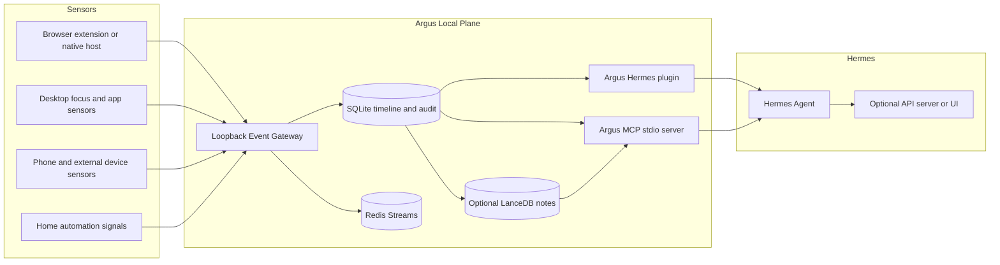
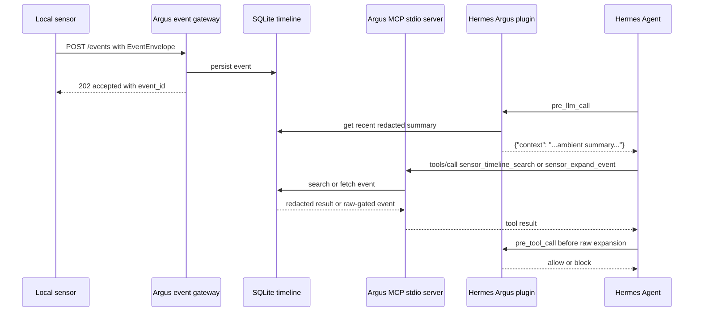

# Best Setup for Injecting Real-World Sensor Context into Hermes Agent with Argus

## Executive summary

The best setup for your use case is a **hybrid local-first architecture**: send all sensor signals into **Argus as normalized local events**, store them in a **local timeline and optional retrieval index**, expose **detail-on-demand through an Argus MCP server**, and inject only a **short redacted ambient summary** into Hermes on each turn through the `pre_llm_call` plugin hook. That matches the strongest official Hermes extension surfaces today: plugin hooks for per-turn context injection, MCP for external tool discovery, and the API server only when you need a UI or an external controller. citeturn13view2turn13view3turn17view0turn13view5turn20view0

That approach is also the one Argus itself is already leaning toward. The Argus spec explicitly recommends **not** stuffing a continuous firehose of sensor notes into the prompt; instead it recommends injecting a short ambient note via `pre_llm_call`, letting Hermes call MCP tools for details, keeping raw evidence referenced by `event_id`, and expanding raw evidence only after a policy gate approves it. The current codebase contains the core pieces for exactly that pattern: a normalized event envelope, a loopback-only event gateway, a local MCP tool surface, a stdio MCP adapter, and a Hermes plugin module. citeturn27view2turn27view3turn40view0turn32view0turn38view0turn28view1

Those compatibility fixes are now implemented in Argus. The package publishes the documented **`hermes_agent.plugins`** entry-point group and keeps legacy **`hermes.plugins`** compatibility, and `pre_tool_call` returns Hermes' documented veto shape, **`{"action": "block", "message": ...}`**. The remaining runtime boundary is plugin enablement: the MCP path is live-verified, while the plugin hook path must be confirmed in the active Hermes environment with `hermes plugins list` showing `argus`. citeturn29view0turn29view1turn15view0turn18view4turn16view2

For your concrete sensor examples, this means:

- **Light switch / home events** should become compact structured Argus events such as `activity.device_state` or `system.external_signal`, stored locally and summarized when relevant.
- **Computer activity** should flow in as `activity.app_focus`, `activity.window_focus`, `activity.focused_field`, and similar typed events.
- **Browser and website activity** should use the existing browser/native-messaging shape Argus already models, because that path is already wired from a page-context message into an `activity.browser_page` event sent to the local gateway.
- **Phone-derived events** should follow the same envelope and same local pipeline, but stay at a higher level unless you are on a platform that legitimately exposes the signal via public APIs. The Argus spec already defines event families for files, browser, health, device usage, reminders, and more; the macOS/browser MVP paths exist now, while richer mobile and specialty collectors remain later work. citeturn27view5turn40view5turn40view0turn27view4

## Hermes Agent surfaces that matter for sensor injection

Hermes currently gives you **five distinct extension surfaces** that matter for this problem, and they are not interchangeable.

The most direct path for **ambient context injection** is the general plugin system. Official docs say plugins can be discovered from `~/.hermes/plugins/`, project-local `.hermes/plugins/`, and pip entry points; they can register tools, hooks, slash commands, CLI commands, skills, and context engines. General plugins are opt-in and must be enabled explicitly, which is exactly what you want for potentially privacy-sensitive local sensor integrations. citeturn18view4turn15view3turn15view0turn18view2

The critical hook is `pre_llm_call`. Hermes documents it as the **only** hook whose return value is used to inject context into the current turn’s user message. The docs also show that this hook is the intended mechanism for memory, RAG, guardrails, and any plugin that needs to provide extra context before the model loop begins. Multiple plugins can return context and Hermes joins them together, which means your Argus summary should stay short and deterministic. citeturn16view2turn22view4

For **detail-on-demand**, the cleanest Hermes-supported mechanism is MCP. Hermes supports both **local stdio MCP servers** and **remote HTTP MCP servers**, auto-discovers tools on startup or reload, and lets you include or exclude tools per server. Local stdio servers are the best fit when the integration is local, sensitive, and low latency; remote HTTP MCP is appropriate only if you intentionally want a network boundary. Hermes also supports `headers` for HTTP auth and OAuth 2.1 PKCE for HTTP/StreamableHTTP MCP servers via `auth: oauth`. citeturn13view3turn17view0turn17view1turn17view4turn17view6turn17view7

For **UI or app-driven control**, Hermes has an API server that exposes an OpenAI-compatible HTTP endpoint. `POST /v1/chat/completions` is stateless and expects the full conversation in the `messages` array. `POST /v1/responses` supports server-side conversation state using `previous_response_id`, and the Runs API exposes long-running sessions with SSE progress events and stop/status endpoints. Authentication is via Bearer token in the `Authorization` header, and the docs are explicit that this server exposes Hermes’ full toolset and should stay loopback-bound unless you intentionally open it up. citeturn13view5turn20view0turn20view1turn20view2turn20view3turn20view4

For **event-triggered workflows**, Hermes also ships a webhook adapter. By default, each webhook POST triggers an agent run; with `deliver_only: true`, the adapter skips the agent entirely and directly delivers a templated message. Every route must have a secret, and the adapter validates source-specific signatures or generic HMAC. This is useful when you want external systems to wake Hermes up, but it is a weaker fit than MCP plus a plugin when your core task is “give Hermes ambient private context every turn.” citeturn19view0turn19view1turn19view2turn19view3turn19view4

Finally, Hermes supports **single-select provider plugins** for memory and context engines. Memory providers are for persistent cross-session knowledge. Context engines replace Hermes’ built-in context compressor. These are powerful, but for your current “inject real-world data as context” goal, they are second-stage options, not where I would start. citeturn18view0turn25view0turn24view0

### What this means for real-time and batch ingestion

If you need **real-time ambient context**, use `pre_llm_call` and keep it cheap. If you need **real-time detailed lookup**, use MCP. If you need **scheduled summarization or periodic consolidation**, Hermes cron is the right batch surface. If you need **external systems to trigger agent runs**, use webhooks. If you need a **frontend or controller app**, use the API server. citeturn16view2turn13view3turn13view8turn19view0turn13view5

## What Argus already implements

Argus already has a surprisingly coherent local sensor plane.

At the data-model layer, Argus defines a canonical `EventEnvelope` with an `event_id`, `event_type`, `schema_version`, source metadata, timestamps, optional `session_id` and `dedupe_key`, `sensitivity`, `raw_scope`, `payload`, `redactions`, `relationships`, and `tags`. The spec’s example event families include app/window activity, browser activity, files, speech, calendar, device usage, perception notes, and system events, which is exactly the right shape for your “light switch + computer activity + phone activity + programs + websites” ambition. citeturn27view1turn27view5

At the ingest layer, Argus has a **loopback-only event gateway**. The gateway accepts normalized envelopes on `/events`, stores a local copy, publishes the event to Redis Streams, exposes `/health`, `/dashboard.json`, `/dashboard`, and `/metrics`, and supports operator control routes for pause, resume, forget, and export. It also rejects non-loopback host bindings. citeturn40view0

At the browser edge, Argus has a **native-messaging adapter** that converts a `page_context` message into an `activity.browser_page` event and posts it to the local gateway URL. That path validates that the gateway target is loopback HTTP with a fixed port and the `/events` path, which is an excellent local-security baseline for website/context sensors. citeturn40view5turn40view0

At the transport layer, Argus has **Redis stream routing** with separate raw streams per platform (`macos`, `ios`, `watchos`), plus streams for derived notes, policy-blocked events, system metrics, and a dead-letter queue. It also includes a Redis consumer-group worker that can read those streams and persist them to SQLite. citeturn41view1turn41view0

At the storage and retrieval layer, Argus uses a **SQLite timeline store with FTS5** plus an **audit log**, and it has a retrieval abstraction with an in-memory note index or a LanceDB-backed note index. In the MCP layer, timeline search first consults the note index when available and then searches or scans the timeline store, while workflow-pattern discovery can come either from Neo4j or from local timeline transitions. citeturn32view3turn32view4turn31view6turn38view0

At the Hermes-facing layer, Argus includes both a **local MCP tool surface** and a **Hermes plugin module**. The MCP surface registers tools for recent-note summaries, event expansion, timeline search, workflow-pattern search, scope pause, scope forget, and session-brief export. The stdio adapter implements a minimal MCP-compatible JSON-RPC dispatcher with `initialize`, `tools/list`, and `tools/call`. The Hermes plugin module wires `pre_llm_call` to `sensor_get_recent_notes` and `pre_tool_call` to event-expansion policy checks. citeturn32view0turn32view1turn32view4turn32view5turn38view3turn38view4turn38view5turn28view1turn28view2

### Argus modules mapped to Hermes integration hooks

| Argus file or module | What it does | Hermes integration point | Recommendation |
|---|---|---|---|
| `events.py` | Canonical event envelope and metadata contract | Input schema for all sensors | Keep this as the single sensor contract; do not invent per-sensor one-off payloads. citeturn27view1turn27view5 |
| `event_gateway.py` | Loopback HTTP ingest, local persist, Redis publish, operator controls | Sensor ingress before Hermes sees anything | Make this the one local ingest endpoint for every sensor emitter. citeturn40view0 |
| `native_messaging.py` | Converts browser page context into Argus events and posts to gateway | Browser and website sensors | Reuse this pattern for browser/page sensors; the macOS app-focus and focused-field MVP paths already follow the same gateway model, while file-specific emitters remain later work. citeturn40view5turn40view0 |
| `streams.py` | Redis stream routing, consumer-group helpers, DLQ | Live local bus behind gateway | Keep Redis loopback-bound for the current live stack; SQLite remains the durable truth store. citeturn41view1 |
| `storage_worker.py` | Reads Redis Streams and writes to SQLite | Batch or fan-out persistence | Run with the live local stack when you want gateway -> Redis -> SQLite fan-out; the no-external-service smoke path is for isolated verification. citeturn41view0 |
| `sqlite_store.py` | Timeline store, FTS5 search, ambient summaries, audit persistence | Backing store for plugin and MCP tools | Make SQLite the first source of truth for local deployment. citeturn40view4turn32view3 |
| `retrieval.py` | Note index and optional LanceDB-backed search | Rich retrieval behind MCP tools | Use when timeline search becomes too weak or you want semantic lookup. citeturn38view0turn32view3 |
| `graph.py` | Optional Neo4j pattern lookup | `sensor_find_workflow_patterns` backend | Leave optional until workflow-pattern mining matters. citeturn31view6turn38view1 |
| `mcp.py` | Local Argus tool registry and policy-gated lookup | Tool surface consumed by Hermes MCP client | This should remain the authoritative detail-on-demand layer. citeturn32view0turn32view1turn34view0 |
| `mcp_stdio.py` | Minimal stdio MCP adapter with tool schemas | Hermes `mcp_servers.<name>.command` | This is the correct way to expose Argus to Hermes as external tools. citeturn38view0turn38view3turn38view4turn39view0 |
| `hermes_plugin.py` | Ambient context injection and raw-access gating | `pre_llm_call`, `pre_tool_call` | Compatibility is fixed for package metadata and veto shape; confirm runtime enablement with `hermes plugins list`. citeturn28view1turn28view2turn29view0turn15view0turn16view2 |

### Current compatibility state

The Argus direction is right, and the latest Hermes compatibility edges are now handled in the repo.

Argus publishes `[project.entry-points."hermes_agent.plugins"]` for current Hermes plugin discovery and keeps `[project.entry-points."hermes.plugins"]` for legacy compatibility. The runtime plugin loader should therefore be checked with `hermes plugins list`; if `argus` is not visible there, the package is not installed into the Python environment Hermes scans. citeturn29view0turn15view0turn18view4

Argus also returns `{"action": "block", "message": ...}` from `pre_tool_call`, which matches the documented Hermes hook veto shape. citeturn28view2turn16view2

## Recommended integration architecture

The recommended design is **not** “inject everything into Hermes.” It is:

- **All sensors** emit typed Argus event envelopes to a **local loopback gateway**.
- Argus writes those events to a **local timeline store** and publishes them through loopback **Redis Streams** in the live local stack.
- Hermes can load an **Argus plugin** that injects only a **short recent ambient summary** via `pre_llm_call`, after plugin discovery is confirmed in the active Hermes runtime.
- Hermes connects to an **Argus stdio MCP server** for on-demand lookup, redacted event expansion, timeline search, workflow patterns, pause, forget, and session-brief export.
- Raw expansion remains **policy gated**, audited, and keyed by `event_id`. citeturn27view2turn27view3turn40view0turn32view0turn32view1turn34view0turn38view3turn38view4

This is the best fit because it matches all four constraints that matter here.

It is **low-latency**. The pre-turn context injection happens from a local store, not a remote network service. Stdio MCP is also local and avoids an extra HTTP hop. Hermes explicitly recommends stdio MCP when the server is local and you want low-latency access to local resources. citeturn17view0

It is **token-efficient**. Hermes’ documented `pre_llm_call` injection should be used for compact context, while Argus’ own spec says the rolling firehose should stay out of the prompt and detail should come through tools. That combination is exactly how you avoid burying the model in stale or duplicative sensor text. citeturn16view2turn22view4turn27view2turn27view3

It is **privacy-preserving**. Argus already defaults toward local-only, loopback-only, policy-redacted handling, with explicit raw-access approval and auditable tool access. Hermes plugins are opt-in, and MCP filtering lets you expose only the tools you really want the model to see. citeturn40view0turn34view0turn18view4turn17view1turn17view3

It is **aligned with the code you already have**. You would be extending existing Argus structures, not fighting them. citeturn28view1turn32view0turn38view0



### Why not use only one integration surface

If you use **only `pre_llm_call`**, you will either over-inject context or end up rebuilding retrieval inside the plugin. If you use **only MCP**, Hermes has to remember to ask for ambient context every time and loses the “just know the recent environment” feel. If you use **only the API server**, you force the caller to manage context assembly, which duplicates Hermes’ own plugin and tool infrastructure. The hybrid plugin-plus-MCP approach avoids all three failure modes. citeturn16view2turn13view3turn13view5turn27view2

## Alternative designs and trade-offs

| Design | Latency | Reliability | Security and privacy | Complexity | Scalability | Verdict |
|---|---|---:|---:|---:|---:|---|
| Hermes webhook route only | Good for event-triggered runs | Good if sender retries | Strong route-secret model, but payload text becomes the prompt unless you stay in `deliver_only` mode | Low | Moderate | Good for “wake Hermes up on event”; not ideal for ambient computer context. citeturn19view0turn19view1turn19view2turn19view4 |
| Hermes API server only | Good | Good | Strong if loopback + bearer key; weak if you push too much private context from callers | Low to moderate | High | Good for a UI/controller, not the best core sensor-injection mechanism. citeturn13view5turn20view0turn20view3 |
| Plugin-only | Excellent | Good if local store is stable | Very private, but all logic lands on the hook hot path | Moderate | Low | Good for tiny setups; weak for detail retrieval and history exploration. citeturn16view2turn22view4 |
| MCP-only | Excellent | Good | Strong because the model only asks for details when needed | Moderate | High | Better than plugin-only, but misses passive “ambient summary” behavior. citeturn13view3turn17view0turn17view3 |
| Filesystem drop only | Moderate | High | Strong if files stay local | Low | Low | Fine for prototypes; poor real-time ergonomics and weaker policy enforcement. |
| Message broker centered | Moderate | High | Good if loopback-only or private network | High | Very high | Useful once you have many sensors or workers; overkill for first deployment. citeturn41view0turn41view1 |
| Hybrid local plugin + local MCP + local gateway | Excellent | High | Best overall local privacy posture | Moderate | High | **Recommended.** It matches Hermes’ documented surfaces and Argus’ current architecture. citeturn13view2turn13view3turn27view2turn40view0turn38view0 |

The only design I would seriously consider instead is **a memory-provider plugin** if your long-term goal becomes “persistent cross-session ambient memory managed entirely inside Hermes.” But that is a bigger commitment, memory plugins are single-select, and they are a poor first step when you already have an external local event plane in Argus. citeturn25view0turn18view0

## Implementation blueprint

### Keep the Hermes compatibility edges locked down

Argus now carries the two required Hermes plugin compatibility details:

```python
# package metadata
[project.entry-points."hermes_agent.plugins"]
argus = "argus_services.hermes_plugin:register"
```

```python
# hook veto return shape
return {"action": "block", "message": decision.reason}
```

That aligns the package with the current official plugin discovery and hook contract. Keep tests around both details so future setup changes do not drift. citeturn15view0turn16view2turn29view0

### Normalize all sensors onto the single Argus envelope

Every sensor should emit the Argus envelope and go through the loopback gateway. Do not build separate direct-to-Hermes sensor adapters for browser activity, app focus, light-switch events, and phone summaries. The event gateway already gives you one ingest path, one store, one metrics surface, and one policy boundary. citeturn27view1turn40view0

A good complete event envelope for computer and phone activity looks like this:

```json
{
  "event_id": "018f4f3c-8d2a-7a51-9c45-8d1f6a3d5e91",
  "event_type": "activity.app_focus",
  "schema_version": "2026-05-11",
  "source_device_id": "macbook-pro",
  "source_platform": "macos",
  "sensor_id": "frontmost_app_sensor",
  "sensor_version": "0.1.0",
  "observed_at": "2026-05-13T20:47:18Z",
  "ingested_at": "2026-05-13T20:47:19Z",
  "session_id": "sess-local-1",
  "dedupe_key": "macbook-pro:frontmost:com.apple.Safari:2026-05-13T20:47",
  "sensitivity": "low",
  "raw_scope": "ephemeral",
  "payload": {
    "app": {
      "bundle_id": "com.apple.Safari",
      "name": "Safari"
    },
    "window": {
      "title": "Vendor pricing - Safari"
    },
    "reason": "frontmost_changed"
  },
  "redactions": [],
  "relationships": [],
  "tags": ["macos", "focus"]
}
```

That style is consistent with the Argus event families and payload examples for app focus, focused field, and browser page activity. citeturn27view5

A simple local emitter looks like this:

```python
import requests

def emit_argus_event(event: dict) -> None:
    r = requests.post("http://127.0.0.1:8765/events", json=event, timeout=2)
    r.raise_for_status()
```

That endpoint and local-gateway flow are already what Argus implements. citeturn40view0

### Use Redis in the live local stack and SQLite as durable truth

For the current Argus live path, start Redis with the local mesh. The gateway stores locally and publishes to Redis before returning success, and the storage worker consumes Redis Streams into SQLite. SQLite remains the durable truth store and audit store; Redis is the loopback-bound staging and replay layer. The no-external-service MVP smoke still exists for isolated verification, but the current live gateway path expects Redis unless a documented no-op or sync publisher mode is added. citeturn40view0turn41view0turn41view1

My recommendation is:

- **Live local MVP**: sensors → gateway → Redis Streams → storage worker → SQLite/audit → MCP/Hermes.
- **Isolated smoke tests**: native host → in-process gateway/store → SQLite/audit → MCP raw gate, without requiring Docker services. citeturn40view0turn41view0

### Expose Argus to Hermes over stdio MCP

Configure Hermes to treat Argus as a local stdio MCP server. This keeps the detailed retrieval surface outside the prompt and inside a narrow, filterable tool namespace. Hermes supports local stdio MCP servers with `command`, `args`, and `env`, and it lets you filter the tool surface per server. citeturn17view0turn17view1turn17view7

```yaml
# ~/.hermes/config.yaml
mcp_servers:
  argus-sensor:
    command: "uv"
    args: ["run", "argus-sensor-mcp"]
    env:
      ARGUS_TIMELINE_DB_PATH: "/Users/you/Library/Application Support/Argus/timeline.db"
      ARGUS_LANCEDB_PATH: "/Users/you/Library/Application Support/Argus/notes.lancedb"
      ARGUS_APPROVAL_TOKEN: "replace-with-local-approval-token"
    tools:
      include:
        - sensor_get_recent_notes
        - sensor_expand_event
        - sensor_timeline_search
        - sensor_find_workflow_patterns
        - sensor_pause_scope
        - sensor_forget_scope
        - sensor_export_session_brief
      resources: false
      prompts: false
```

The verified local CLI setup path is:

```sh
hermes mcp add argus-sensor \
  --command uv \
  --env "ARGUS_TIMELINE_DB_PATH=$ARGUS_TIMELINE_DB_PATH" \
  --env "ARGUS_LANCEDB_PATH=$ARGUS_LANCEDB_PATH" \
  --env "ARGUS_APPROVAL_TOKEN=$ARGUS_APPROVAL_TOKEN" \
  --args run argus-sensor-mcp
hermes mcp test argus-sensor
```

If Hermes asks whether to add the MCP server, answer `Y`.

Once configured, Hermes will discover the tools at startup or after `/reload-mcp`. Remember that Hermes prefixes MCP tools with `mcp_<server>_<tool>` when registering them to the model, but include/exclude filters use the original MCP tool names. citeturn17view2turn17view7turn23view0turn38view3turn38view4

### Inject only a compact ambient summary with a Hermes plugin

Your plugin should do one thing on the hot path: ask Argus for the recent redacted summary and return it as a short `context` string. Anything heavier belongs in MCP tools, not the injected prompt. Hermes documents `pre_llm_call` as the context injection hook, and Argus’ own spec recommends precisely this split. citeturn22view4turn27view2turn27view3

```python
# ~/.hermes/plugins/argus/__init__.py
import os
from argus_services.mcp_stdio import local_mcp_server_from_env
from argus_services.policy import RedactionPolicy

def register(ctx):
    server = local_mcp_server_from_env()
    policy = RedactionPolicy(approval_token=os.getenv("ARGUS_APPROVAL_TOKEN"))

    def inject_argus_context(session_id=None, **_):
        result = server.call_tool(
            "sensor_get_recent_notes",
            limit=5,
            actor=session_id or "hermes",
        )
        context = result.get("context")
        if not context:
            return None
        return {"context": context}

    def gate_raw_sensor_access(tool_name=None, args=None, arguments=None, **_):
        params = arguments or args or {}

        # Hermes MCP tool names are prefixed with mcp_<server>_
        if tool_name not in {"sensor_expand_event", "mcp_argus_sensor_expand_event"}:
            return None

        if params.get("raw_mode") != "full":
            return None

        event_id = params.get("event_id")
        if not event_id:
            return {"action": "block", "message": "event_id is required for full raw access"}

        event = server.store.get(event_id)
        if event is None:
            return {"action": "block", "message": "unknown event_id"}

        decision = policy.evaluate_raw_access(
            event,
            approval_token=params.get("approval_token"),
            raw_mode="full",
        )
        if not decision.allowed:
            return {"action": "block", "message": decision.reason}

        return None

    ctx.register_hook("pre_llm_call", inject_argus_context)
    ctx.register_hook("pre_tool_call", gate_raw_sensor_access)
```

That pattern keeps the injection cheap while still preventing accidental raw expansion. It also aligns the veto return value with the documented Hermes hook shape. citeturn16view2turn28view1turn28view2turn34view0

The plugin package contract is tested today. Treat runtime hook injection as enabled only after `hermes plugins list` shows `argus` in the active Hermes runtime and `hermes plugins enable argus` succeeds. The MCP setup above is the primary live-verified path.

### Use the existing browser path as the template for websites and programs

Argus’ existing browser path is the best concrete template in the repo for your website/program context injectors. A native message carrying `page_context` becomes an `activity.browser_page` event and is posted to the local gateway. The macOS app-focus, focused-field, heartbeat, and ScreenCaptureKit/Vision OCR MVP paths now follow the same principle: local source → normalized envelope → local gateway. citeturn40view5turn40view0turn27view5

### Sequence of data flow



## Security, privacy, testing, and deployment

### Security and privacy considerations

The strongest part of the current design is that both Hermes and Argus already support a local-only security posture. Hermes’ API server defaults to `127.0.0.1`, and the docs warn that exposing it gives access to Hermes’ full toolset. Argus’ event gateway rejects non-loopback bindings, and the browser/native-messaging path validates a loopback-only gateway URL. Keep that default. citeturn13view5turn40view0turn40view5

Argus already gives you the right privacy primitives for sensor data: event-level `sensitivity`, `raw_scope`, deterministic redaction, blocked surfaces, approval-token-gated raw access, and audit logging around tool access and purges. Use them aggressively. In practice that means: store enough structure to retrieve by `event_id`, but only inject summaries into Hermes; keep raw payloads either ephemeral or explicitly durable-by-policy; and make full expansion rare, audited, and user-approvable. citeturn27view1turn34view0turn32view1turn32view2turn33view3

### Raw local events, sanitized outputs, and audit trail

The current Argus dashboard should be read as three separate views of the same
sensor system:

- **Raw Local Events**: complete local event envelopes stored for operator
  inspection and policy-gated retrieval.
- **Sanitized Hermes Outputs**: redacted summaries, search matches, redacted
  event expansions, and session briefs that are safe to send to Hermes by
  default.
- **Audit Trail**: every ingest, MCP-facing access, export, pause/resume, forget,
  and raw-access decision with actor, tool, scope, event count, allow/block
  status, redactions applied, and relevant sanitized or raw-local details.

This split is important: raw data is visible to the local operator and audit
system, but is not sent to AI unless the user intentionally requests and
approves a policy-gated raw expansion.

One subtle but important security point is tool exposure. Hermes’ MCP docs strongly emphasize per-server filtering and “the smallest useful surface.” Do that here. Give Hermes the search, summary, expand, pause, forget, and brief-export tools, but do not expose anything broader than necessary. citeturn17view1turn17view3

### Error-handling patterns

Use a small number of predictable failure modes.

At ingest time, if the gateway returns a pause-related error or policy-rejection behavior, the sensor should **drop or buffer locally** and record the reason instead of retrying blindly. The gateway already supports pause and forget controls and returns structured JSON. citeturn40view0

At plugin time, `pre_llm_call` should **fail open** and return `None` if Argus is unavailable, so Hermes can still answer normally. That follows Hermes’ hook model and avoids bricking the whole turn because the ambient-context helper failed. citeturn16view2turn22view4

At MCP-tool time, error results should remain structured and narrow. Argus already returns explicit results for missing events, denied raw access, and redacted versus full modes in `sensor_expand_event`. Keep that pattern. citeturn34view0

### Testing and validation plan

Use three layers of validation.

First, test the **sensor contract**: every sensor should produce valid `EventEnvelope` objects with stable `dedupe_key`, correct `source_platform`, and the right `event_type` family. Second, test the **privacy contract**: blocked surfaces stay blocked, raw expansions require approval, and redacted summaries never leak tokens or secrets. Third, test the **Hermes contract**: the plugin injects context in the documented shape, the MCP server enumerates tools correctly, and a Hermes session can use those tools after discovery or `/reload-mcp`. citeturn27view1turn34view0turn38view3turn17view2

A practical validation sequence is:

- emit a known browser page event;
- verify it appears in SQLite;
- call the Argus MCP `sensor_get_recent_notes`;
- run `hermes mcp add argus-sensor` and `hermes mcp test argus-sensor`;
- after `hermes plugins list` shows `argus`, start Hermes and confirm `pre_llm_call` adds a short ambient summary;
- ask Hermes something like “what have I been working on recently?” and confirm it answers from injected summary;
- then ask Hermes to show details and confirm it reaches for the MCP search/expand tools rather than inventing them. citeturn32view1turn32view3turn13view4

### Deployment checklist

Use this as the minimum deployment baseline:

- Bind **Argus gateway**, **Redis**, and **Hermes API server** to loopback only. citeturn40view0turn13view5
- Put sensor data into **one normalized envelope** and **one local ingress endpoint**. citeturn27view1turn40view0
- Expose Argus to Hermes as a **local stdio MCP server** with a filtered tool list. citeturn17view0turn17view1turn38view3
- Inject only a **short redacted summary** through `pre_llm_call`. citeturn16view2turn27view2
- Make **raw expansion** explicitly gated and audited. citeturn34view0turn32view2
- Keep the **plugin entry-point group** and **pre_tool_call veto shape** matched to current Hermes docs. citeturn29view0turn15view0turn16view2
- Keep LanceDB and Neo4j **optional** until you actually need semantic retrieval or graph mining; keep Redis as the live local replay/fan-out bus. citeturn41view0turn38view0turn31view6

### Setup prompts and expected operator answers

Use a staged setup so permissions and raw access stay intentional:

- Export `ARGUS_TIMELINE_DB_PATH`, `ARGUS_LANCEDB_PATH`, and
  `ARGUS_APPROVAL_TOKEN` before starting Argus services.
- Run `uv pip install -e /Users/james/code/argus/argus` from the repo root.
- Start the local mesh, gateway, and storage worker before using the live
  gateway path.
- When `hermes mcp add argus-sensor` asks to confirm adding the server, answer
  `Y`.
- Treat `hermes plugins list` as the source of truth for plugin hook
  availability; do not claim hook injection is enabled until it lists `argus`.
- When installing the browser native host, paste the exact
  `chrome-extension://<extension-id>/` origin including the trailing slash.
- On macOS, request Accessibility before structural focused-field collection and
  request Screen Recording only when the OCR fallback is needed.

## Open questions and limitations

There are two limitations worth calling out clearly.

The first is **Hermes version labeling**. In the official repo surfaces I reviewed, the repository page and the releases page appear to show inconsistent version labels around the March 28, 2026 stable line, while the docs site itself has pages updated through late April and early May 2026. Because of that, I treated the **current official docs site and current official repo docs** as the operative contract for extension surfaces, rather than trusting a single version label at face value. citeturn0search0turn21search0turn14search6turn14search10

The second is **Argus completeness**. The repo already has the right architectural spine for Hermes integration. The browser/native-messaging path, event gateway, SQLite store, MCP surface, plugin package, frontmost/focused-field macOS paths, runtime heartbeats, and ScreenCaptureKit/Vision OCR fallback are concrete. The broader cross-device and specialty collector pipeline still needs build-out: MailKit, EventKit, FSEvents, File Provider, Endpoint Security, Speech, DeviceActivity, HealthKit, WatchConnectivity, richer home/device events, fresh-install permission verification, and release signing/notarization remain next functional work. citeturn27view4turn8view0turn40view0turn38view0turn28view1
